# A gym tracker built around the set you're about to do

An iPhone workout tracker: exercise library, workouts you build, sets logged as
you lift them, rest timer, and the graphs afterwards. Native Swift, no ads, no
account. Your data stays on the phone, plus your own iCloud Drive if you
turn backup on.

The active-workout screen is the product. Everything else is setup for it.

```
 ×          Fraiser Heights  00:14:22       ≡
 ▬▬▬ ━━━ ▬▬▬ ▬▬▬ ▬▬▬ ▬▬▬
 Seated Machine Rows                 ( ▶| Skip )
 Back · Machine
 ● ○ ○  Set 2 of 3 ⌄              LAST TIME
                                  10 × 50 lb
 ╭──────────────────────────────────────────╮
 │ ( − )           10 REPS           ( + )  │
 ╰──────────────────────────────────────────╯
 ╭──────────────────────────────────────────╮
 │ ( − )      50.0 LB  ± 10 lb       ( + )  │
 ╰──────────────────────────────────────────╯
 ╭──────────────────────────────────────────╮
 │                ✓ Log set                 │
 ╰──────────────────────────────────────────╯
 Next  Lat Pull Downs          3 × 10 · 60 lb
```

## Three decisions worth knowing

**The thing you do fifty times a workout is the biggest thing on screen.**
Logging a set is one tap on a full-width button in the thumb zone — not a side
effect of adjusting a number.

**`+` moves the weight by what the equipment actually allows.** A machine steps
by one pin (10 lb), a barbell by a plate pair (5 lb), a dumbbell by the rack's
step, a resistance band not at all. A universal `±1` means ten taps and loads
no plate set can make.

**The log is the truth; the plan is a suggestion.** Going lighter mid-set writes
that number into the log and leaves the saved workout alone. Pushing it back
into the template is a separate, deliberate question at the end.

## Layout

```
Core/       pure Foundation — session state machine, rest timer, units,
            equipment increments, stats, progression, the SQLite store and
            the 300-movement catalogue. No SwiftUI.
Sources/    SwiftUI. Draws Core's state and sends it events. Holds no rules.
docs/       design, interface, build order
```

Every bug that matters here is a rules bug — a set counter that strands a
completed set, a timer that restarts instead of extending, a personal record
that never matches because two equal weights compare unequal. Those live in
`Core` so they can be tested in a second, on a Mac, with no simulator involved.

## Docs

- [`docs/DESIGN.md`](docs/DESIGN.md) — problem, options, decision, constraints, risks
- [`docs/UIUX_DESIGN.md`](docs/UIUX_DESIGN.md) — screen map and flows
- [`docs/uiux/`](docs/uiux/) — every screen and state, drawn
- [`docs/IMPLEMENT_PLAN.md`](docs/IMPLEMENT_PLAN.md) — build order, task by task
- [`docs/release/`](docs/release/) — App Store listing, privacy policy, screenshots

## Development

Plain Swift and SwiftUI. No Expo, no React Native, no third-party packages.
The Xcode project is generated from `project.yml` by
[xcodegen](https://github.com/yonaskolb/XcodeGen) — a dev tool, not a
dependency — and the generated project is committed.

```sh
brew install xcodegen          # once
xcodegen generate
open GymBuddy.xcodeproj

cp Local.xcconfig.example Local.xcconfig   # your Team ID, gitignored
make test                      # Core, ~1s, no simulator
make device                    # build + install on the paired iPhone
make release                   # archive + upload — docs/release/
```

Debug builds take `-demo` (a phone full of history, in memory — the real
database is never opened) and `-screen <name>` to open straight onto one
screen; `make capture` uses both for store screenshots.

Signing is not committed. Set your team at build time:

```sh
xcodebuild -scheme GymBuddy DEVELOPMENT_TEAM=YOUR_TEAM_ID
```

### Physical device only

QA runs on a real iPhone. Don't fall back to a simulator for anything but a
compile check.

## Not a coach

Exercise instructions describe how a movement is performed. They are not
medical, physiotherapy, or coaching advice, and the app will not write your
training programme.

## Screenshots

Captured from an iPhone 14 with the `-demo` data (`make capture`).

<table>
<tr>
<th>Session</th><th>Resting</th><th>Set running</th>
</tr>
<tr>
<td>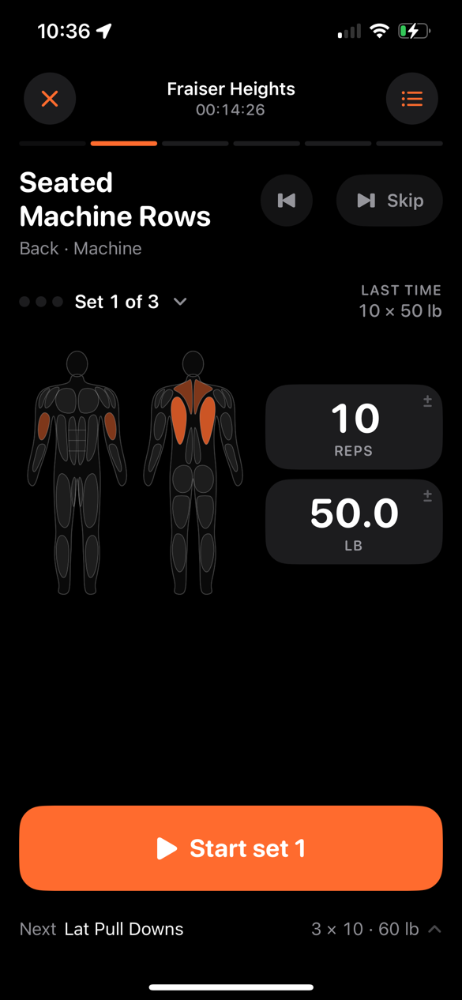</td>
<td>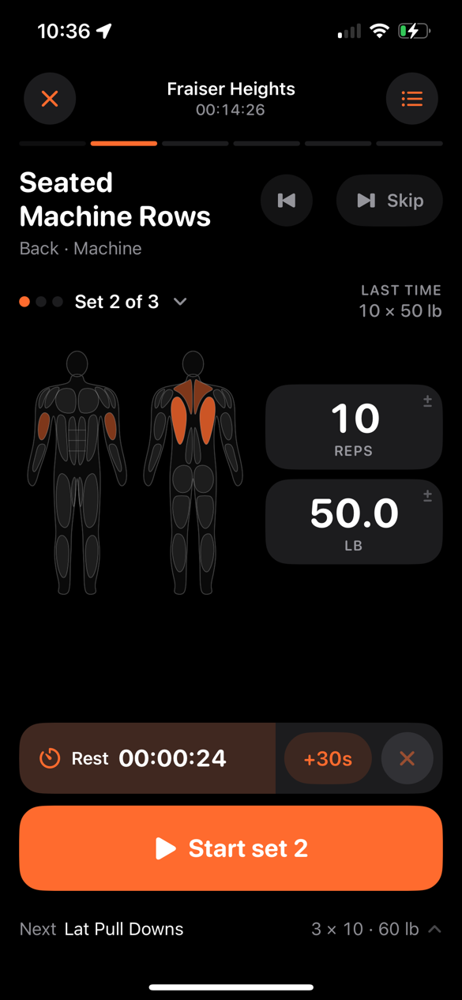</td>
<td>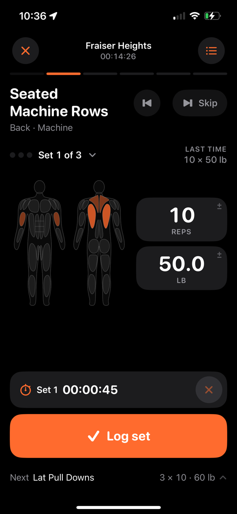</td>
</tr>
<tr>
<th>Treadmill countdown</th><th>Train</th><th>Kept in background</th>
</tr>
<tr>
<td>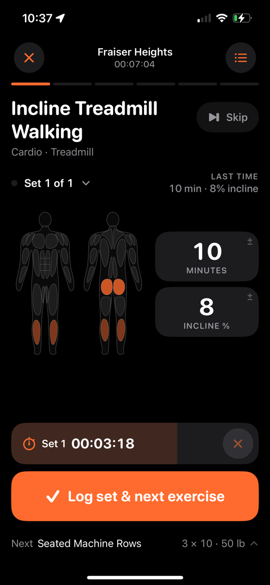</td>
<td>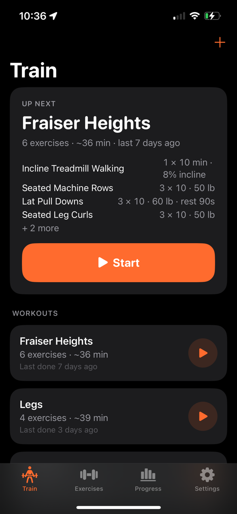</td>
<td>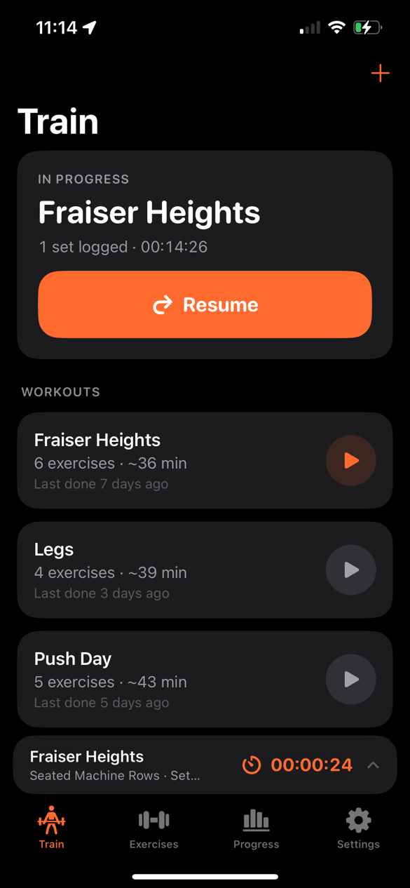</td>
</tr>
<tr>
<th>Progress</th><th>Trend</th><th>Exercise</th>
</tr>
<tr>
<td>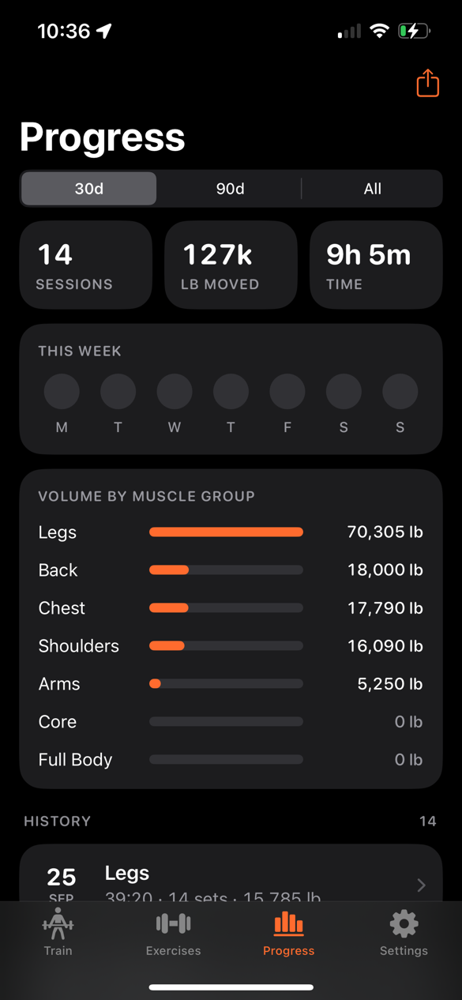</td>
<td>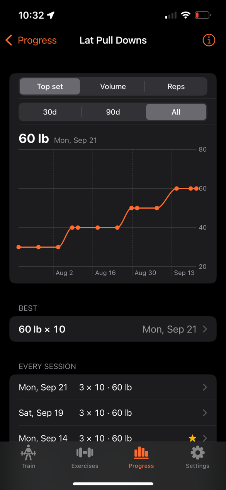</td>
<td>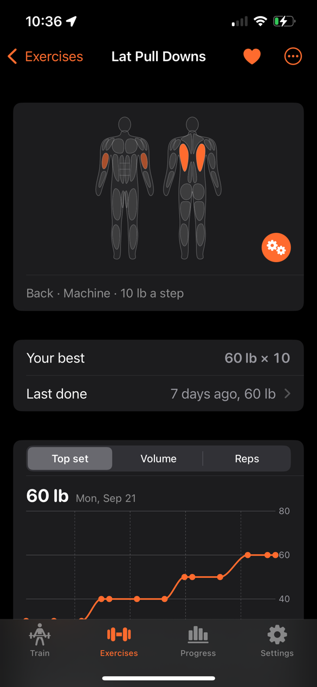</td>
</tr>
<tr>
<th>Summary</th><th>Exercise library</th><th></th>
</tr>
<tr>
<td>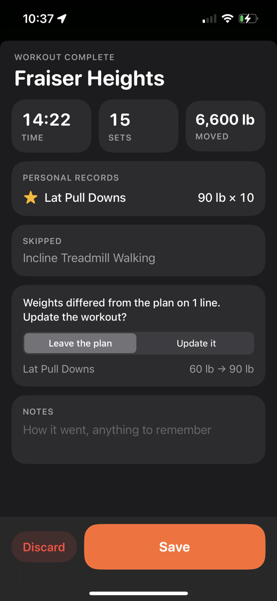</td>
<td>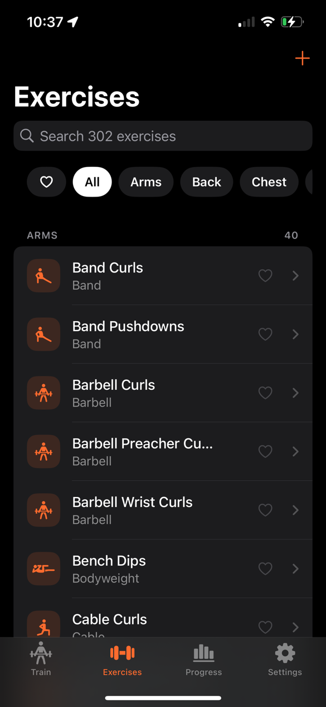</td>
<td></td>
</tr>
</table>
